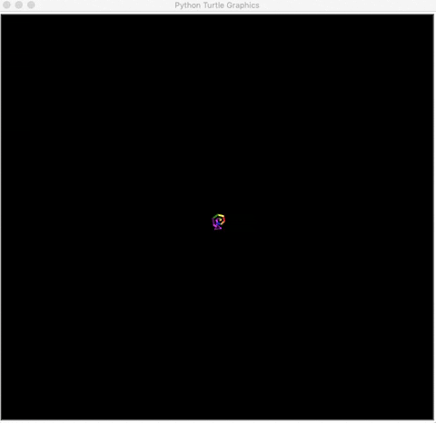
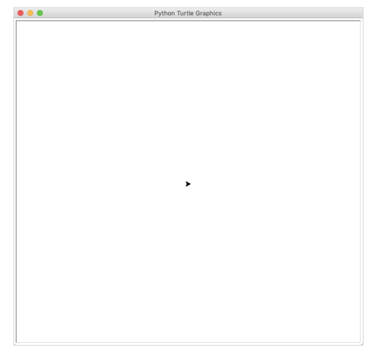

# LEKCE 5 - TURTLE, SEZNAMY

Opakování (20 min)

Dnes se naučíme:

Co jsou to seznamy a jaké mají využití

Co je to python knihovna TURTLE

Jak jí používat v Pythonu

Co pomocí Turtle můžeme programovat

Na závěr si naprogramujeme krátkou hru 

## Seznamy

Cheatsheet: https://github.com/pyvec/cheatsheets/blob/master/lists/lists-cs.pdf

Dnes si ukážeme, jak pracovat se seznamy (angl. lists). Doufám, že víš, kde máš na klávesnici hranaté závorky, protože právě těmi se seznamy vytváří:

```python
cisla = [1, 1, 2, 3, 5, 8, 13]
print(cisla)
```

Nemůžeš najít hranaté závorky? Na české klávesnici zkus pravý Alt + F a G.

Seznam je hodnota, která může obsahovat spoustu dalších hodnot. Tak jako řetězec obsahuje sekvenci znaků, seznam obsahuje sekvenci... čehokoliv. Třeba čísel. A tak jako můžeme pomocí cyklu for procházet řetězec po znacích, seznam můžeme procházet po jednotlivých prvcích:

```python
for cislo in cisla:
    print(cislo)
```

Seznamy se v programech vyskytují velice často: soubor se dá načíst jako seznam řetězců s jednotlivými řádky, seznam řetězců jako '7♥' a 'K♣' může posloužit jako balíček karet, matematika je plná číselných řad, každá online služba má seznam uživatelů.

Hodnoty v seznamu můžou být jakéhokoli typu, dokonce můžeme různé typy míchat v jednom seznamu (i když s takovými namixovanými seznamy se příliš často nesetkáme – více se používají v n-ticích, o kterých si povíme později):

```python
seznam = [1, 'abc', True, None, range(10), len]
print(seznam)
```

### Vybírání ze seznamů

Nejzákladnější operaci se seznamy, cyklus for, už jsme si ukázali. Druhá nejdůležitější operace je vybírání jednotlivých prvků. To funguje jako u řetězců: do hranatých závorek se dá číslo prvku. Čísluje se, jako u řetězců, od nuly; záporná čísla označují prvky od konce.

```python
print(cisla[2])
```

Hranatými závorkami můžeme získávat podseznamy. Diagram z materiálů k řetězcům ukazuje, jak u takového „sekání” číslovat: funguje to stejně, jen místo menšího řetězce dostaneme menší seznam.

```python
print(cisla[2:-3])
```

### Měnění seznamů

Důležitá vlastnost seznamů, kterou nemají ani čísla, ani řetězce (a True/False/None už vůbec ne), je, že seznamy se dají měnit.

Čísla měnit nejdou – máš-li a = 3 a napíšeš a = a + 1, číslo 3 se nezmění. Vypočítá se nové číslo 4 a proměnná a se nastaví na toto nové číslo.

Oproti tomu seznamy se dají měnit bez nastavování proměnné. Základní způsob, jak změnit seznam, je přidání prvku na konec pomocí metody append. Ta nic nevrací (resp. vrací None), ale „na místě” (angl. in place) změní seznam, na kterém pracuje. Vyzkoušej si to:

```python
prvocisla = [2, 3, 5, 7, 11, 13, 17]
print(prvocisla)
prvocisla.append(19)
print(prvocisla)
```

Takové měnění hodnoty může být občas překvapující, protože stejnou hodnotu může mít více proměnných. Protože se mění hodnota samotná, může to vypadat, že se proměnná „mění aniž na ni sáhneme”:

```python
a = [1, 2, 3]   # vytvoření seznamu
b = a           # tady se nový seznam nevytváří
```

Seznam vytvořený v prvním řádku má teď dvě jména: "a" a "b", ale stále pracujeme jenom s jedním seznamem

```python
print(b)
a.append(4)
print(b)
```

### Další způsoby, jak měnit seznamy

Kromě metody append, která přidává jediný prvek, existuje metoda extend, která umí přidávat prvků víc. Prvky k přidání jí předáme ve formě seznamu:

```python
dalsi_prvocisla = [23, 29, 31]
prvocisla.extend(dalsi_prvocisla)
print(prvocisla)
```

Metoda extend umí pracovat i s jinými typy než se seznamy – ráda zpracuje cokoli, přes co umí cyklit for: např. jednotlivé znaky řetězců, řádky souborů, nebo čísla z range().

```python
seznam = []
seznam.extend('abcdef')
seznam.extend(range(10))
print(seznam)
```

### Měnění prvků
Ale dost přidávání. Seznamům se dají i měnit jednotlivé prvky a to jednoduše tak, že do prvku přiřadíme, jako by to byla proměnná:

```python
cisla = [1, 0, 3, 4]
cisla[1] = 2
print(cisla)
```

Přiřazovat se dá i do podseznamu – v tomto případě se podseznam nahradí jednotlivými prvky z toho, co přiřazujeme. Jako u extend můžeš do podseznamu opět přiřadit cokoli, co umí zpracovat for – seznam, řetězec, range() apod.

```python
cisla = [1, 2, 3, 4]
cisla[1:-1] = [6, 5]
print(cisla)
```

### Mazání prvků

Přiřazením do podseznamu se dá i změnit délka seznamu, nebo některé prvky úplně odstranit:

```python
cisla = [1, 2, 3, 4]
cisla[1:-1] = [0, 0, 0, 0, 0, 0]
print(cisla)
cisla[1:-1] = []
print(cisla)
```

Tenhle zápis pro mazání prvků je ale docela nepřehledný, a proto na to máme zvláštní příkaz jménem del. Jak už jeho název (z angl. delete, smazat) napovídá, smaže, co mu přijde pod ruku – jednotlivé prvky seznamů, podseznamy, … a dokonce i proměnné!

```python
cisla = [1, 2, 3, 4, 5, 6]
del cisla[-1]
print(cisla)
del cisla[3:5]
print(cisla)
del cisla
print(cisla)
```

Další mazací metody jsou:

`pop`, která odstraní a vrátí poslední prvek v seznamu – například pokud mám seznam karet v balíčku, jde takhle jednoduše „líznout” kartu,
`remove`, která najde v seznamu daný prvek a odstraní ho,
`clear`, která vyprázdní celý seznam.

```python
cisla = [1, 2, 3, 'abc', 4, 5, 6, 12]
posledni = cisla.pop()
print(posledni)
print(cisla)

cisla.remove('abc')
print(cisla)

cisla.clear()
print(cisla)
```

### Řazení

A taky tu máme metodu sort, která prvky seznamu seřadí.

```python
seznam = [4, 7, 8, 3, 5, 2, 4, 8, 5]
seznam.sort()
print(seznam)
```

Aby se daly seřadit, musí být prvky seznamu vzájemně porovnatelné – konktrétně na ně musí fungovat operátor <. Seznam s mixem čísel a řetězců tedy seřadit nepůjde. Operátor < definuje i jak přesně se řadí (např. čísla podle velikosti; řetězce podle speciální „abecedy” která řadí velká písmena za malá, česká až za anglická, atd.).

Metoda sort zná pojmenovaný argument reverse. Pokud ho nastavíš na True, řadí se „naopak”.

```python
seznam = [4, 7, 8, 3, 5, 2, 4, 8, 5]
seznam.sort(reverse=True)
print(seznam)
```

### Známé operace se seznamy

Spousta toho, co můžeme dělat s řetězci, má stejný účinek i u seznamů. Třeba sečítání a násobení číslem:

```python
melodie = ['C', 'E', 'G'] * 2 + ['E', 'E', 'D', 'E', 'F', 'D'] * 2 + ['E', 'D', 'C']
print(melodie)
```

Stejně jako u řetězců, sečítat jde jen seznam se seznamem – ne třeba seznam s řetězcem.

Další staří známí jsou funkce `len`, metody `count` a `index`, a operátor `in`.

```python
print(len(melodie))         # Délka seznamu
print(melodie.count('D'))   # Počet 'D' v seznamu
print(melodie.index('D'))   # Číslo prvního 'D'
print('D' in melodie)       # Je 'D' v seznamu?
```

Poslední tři se ale přece jen chovají kapku jinak: u řetězců pracují s podřetězci, u seznamů jen s jednotlivými prvky. Takže ačkoliv naše melodie obsahuje prvky 'D' a 'E' vedle sebe, 'DE' v seznamu není:

```python
print('DE' in melodie)
print(melodie.count('DE'))
print(melodie.index('DE'))
```

### Seznam jako podmínka

Seznam se dá použít v příkazu if (nebo while) jako podmínka, která platí, když v tom seznamu něco je. Jinými slovy, seznam je tu „zkratka“ pro len(seznam) > 0.

```python
if seznam:
    print('V seznamu něco je!')
else:
    print('Seznam je prázdný!')
```

Podobně se dají v podmínce použít i řetězce. A dokonce i čísla – ta jako podmínka platí, pokud jsou nenulová.

### Tvoření seznamů

Tak jako funkce int převádí na celá čísla a str na řetězce, funkce list (angl. seznam) převádí na seznam. Jako argument jí předáme jakoukoli hodnotu, kterou umí zpracovat příkaz for. Z řetězců udělá seznam znaků, z otevřeného souboru udělá seznam řádků, z range udělá seznam čísel.

```python
abeceda = list('abcdefghijklmnopqrstuvwxyz')
cisla = list(range(100))
print(abeceda)
print(cisla)
```

I ze seznamu udělá funkce list seznam. To může znít zbytečně, ale není – vytvoří se totiž nový seznam. Bude mít sice stejné prvky ve stejném pořadí, ale nebude to ten samý seznam: měnit se bude nezávisle na tom starém.

```python
a = [1, 2, 3]
b = list(a)

print(b)
a.append(4)
print(b)
```

Další způsob, jak tvořit seznamy (zvláště složitější), je nejdřív udělat prázdný seznam a pak ho postupně naplnit pomocí funkce append. Třeba pokud z nějakého důvodu chceš seznam mocnin dvou, projdi čísla, kterými chceme mocnit, cyklem for a pro každé z nich do seznamu přidej příslušnou mocninu:

```python
mocniny_dvou = []
for cislo in range(10):
    mocniny_dvou.append(2 ** cislo)
print(mocniny_dvou)
```

Chceš-li seznam, který reprezentuje balíček karet, zavolej append pro všechny kombinace barev a hodnot.

```python
balicek = []
for barva in '♠', '♥', '♦', '♣':  # (Na Windows použij textová jména)
    for hodnota in list(range(2, 11)) + ['J', 'Q', 'K', 'A']:
        balicek.append(str(hodnota) + barva)
print(balicek)
```

## Seznamy a řetězce

Seznamy a řetězce jsou druhy „sekvencí”, takže snad nepřekvapí, že se dá různě převádět z jednoho typu na druhý. Funkce list vytvoří z řetězce seznam znaků. Když chceme dostat seznam slov, použijeme na řetězci metodu split (angl. rozdělit):

```python
slova = 'Tato věta je složitá, rozdělme ji na slova!'.split()
print(slova)
```

Metoda split umí brát i argument. Pokud ho předáme, místo mezer (a nových řádků) se řetězec „rozseká” daným oddělovačem. Takže když máme nějaká data oddělená čárkami, není nic jednoduššího než použít split s čárkou:

```python
zaznamy = '3A,8B,2E,9D'.split(',')
print(zaznamy)
```

Chceme-li spojit seznam řetězců zase dohromady do jediného řetězce, použijeme metodu join (angl. spojit). Pozor, tahle metoda se volá na oddělovači, tedy řetězci, kterým se jednotlivé kousky „slepí” dohromady; a jako argument bere seznam jednotlivých řetězců.

```python
veta = ' '.join(slova)
print(veta)
```

### Úkol

Představ si, že ti uživatelé zadávají jména a příjmení a ty si je ukládáš do seznamu pro další použití např. v evidenci studentů. Ne všichni jsou ale pořádní, a tak se v seznamu sem tam objeví i jméno s nesprávně zadanými velkými písmeny. Například:

```python
zaznamy = ['pepa novák', 'Jiří Sládek', 'Ivo navrátil', 'jan Poledník']
```

Úkolem je:

Napsat funkci, která vybere jen ty správně zadané záznamy, které mají správně jméno i příjmení s velkým počátečním písmenem.
Napsat funkci, která vybere naopak jen ty nesprávně zadané záznamy.
(Nepovinný) – Napsat funkci, která vrátí seznam s opravenými záznamy.
Výsledné funkce by měly fungovat takto:

```python
zaznamy = ['pepa novák', 'Jiří Sládek', 'Ivo navrátil', 'jan Poledník']

chybne_zaznamy = vyber_chybne(zaznamy)
print(chybne_zaznamy) # → ['pepa novák', 'Ivo navrátil', 'jan Poledník']

spravne_zaznamy = vyber_spravne(zaznamy)
print(spravne_zaznamy) # → ['Jiří Sládek']

opravene_zaznamy = oprav_zaznamy(zaznamy)
print(opravene_zaznamy) # → ['Pepa Novák', 'Jiří Sládek', 'Ivo Navrátil', 'Jan Poledník']
```

Snadný způsob jak zjistit, zda je řetězec složen jen z malých písmen, je metoda islower(), která vrací True, pokud řetězec obsahuje jen malá písmena, jinak vrací False. Například 'abc'.islower() == True ale 'aBc'.islower() == False.

Snadný způsob jak převést první písmenko na velké je metoda `capitalize()`: např. 'abc'.capitalize() == 'Abc'

#### Řešení

```python
def vyber_chybne(seznam):
    vysledek = []
    for zaznam in seznam:
        jmeno_a_prijmeni = zaznam.split(' ')
        jmeno = jmeno_a_prijmeni[0]
        prijmeni = jmeno_a_prijmeni[1]
        if jmeno[0].islower() or prijmeni[0].islower():
            vysledek.append(zaznam)
    return vysledek

def vyber_spravne(seznam):
    vysledek = []
    for zaznam in seznam:
        jmeno_a_prijmeni = zaznam.split(' ')
        jmeno = jmeno_a_prijmeni[0]
        prijmeni = jmeno_a_prijmeni[1]
        if not jmeno[0].islower() and not prijmeni[0].islower():
            vysledek.append(zaznam)
    return vysledek

def oprav_zaznamy(seznam):
    vysledek = []
    for zaznam in seznam:
        jmeno_a_prijmeni = zaznam.split(' ')
        jmeno = jmeno_a_prijmeni[0]
        prijmeni = jmeno_a_prijmeni[1]
        vysledek.append(jmeno.capitalize() + ' ' + prijmeni.capitalize())
    return vysledek
```

## Seznamy a náhoda

Modul random obsahuje dvě funkce, které se hodí k seznamům. Jako random.randrange, obě mají něco společného s náhodou.

Funkce shuffle seznam „zamíchá” – všechny prvky náhodně popřehází. Jako metoda sort i funkce shuffle nic nevrací.

```python
import random

balicek = []
for barva in '♠', '♥', '♦', '♣':
    for hodnota in list(range(2, 11)) + ['J', 'Q', 'K', 'A']:
        balicek.append(str(hodnota) + barva)
print(balicek)

random.shuffle(balicek)
print(balicek)
```

A funkce choice ze seznamu vybere jeden náhodný prvek. S použitím seznamu tak můžeme výrazně zjednodušit úvodní část naší staré hry kámen/nůžky/papír:

```python
import random
mozne_tahy = ['kámen', 'nůžky', 'papír']
tah_pocitace = random.choice(mozne_tahy)
```

## Vnořené seznamy
A perlička na konec! Na začátku tohoto textu je napsáno, že seznam může obsahovat jakýkoli typ hodnot. Může třeba obsahovat i další seznamy:

```python
seznam_seznamu = [[1, 2, 3], [4, 5, 6], [7, 8, 9]]
```

Takový seznam se chová docela normálně – jdou z něj třeba brát jednotlivé prvky (které jsou ovšem taky seznamy):

```python
prvni_seznam = seznam_seznamu[0]
print(prvni_seznam)
```

A protože jsou prvky samy seznamy, můžeme mluvit o věcech jako „první prvek druhého seznamu”:

```python
druhy_seznam = seznam_seznamu[1]
prvni_prvek_druheho_seznamu = druhy_seznam[0]
print(prvni_prvek_druheho_seznamu)
```

A protože výraz seznam_seznamu[1] označuje seznam, můžeme brát prvky přímo z něj:

```python
prvni_prvek_druheho_seznamu = (seznam_seznamu[1])[0]
```

Neboli:

```python
prvni_prvek_druheho_seznamu = seznam_seznamu[1][0]
```

A má tahle věc nějaké použití, ptáš se? Stejně jako vnořené cykly for nám umožnily vypsat tabulku, vnořené seznamy nám umožní si tabulku „zapamatovat”.

```python
def vytvor_tabulku(velikost=11):
    seznam_radku = []
    for a in range(velikost):
        radek = []
        for b in range(velikost):
            radek.append(a * b)
        seznam_radku.append(radek)
    return seznam_radku

nasobilka = vytvor_tabulku()

print(nasobilka[2][3])  # dva krát tři
print(nasobilka[5][2])  # pět krát dva
print(nasobilka[8][7])  # osm krát sedm
```

### Vypsání celé tabulky

```python
for radek in nasobilka:
    for cislo in radek:
        print(cislo, end=' ')
    print()
```

Co s takovou „zapamatovanou” tabulkou? Můžeš si do ní uložit třeba pozice figurek na šachovnici nebo křížků a koleček ve 2D piškvorkách.


## Co je to knihovna turtle

`turtle` je předinstalovaná knihovna, díky které může uživatel vytvářet různé obrázky a tvary na virtuálním plátně. Peru, kterým kreslíme, se říká turtle (anglicky želva) a podle toho je celá knihovna pojmenovaná. Ve zkratce, knihovna turtle ukazuje programování v interaktivní podobě.

S touto knihovnou můžete vykreslovat a vytvářet různé variace tvarů a obrazců. Zde je malá ukázka:



## Začínáme programovat s turtle

Jak jsme si již řekli, turtle je předinstalovaná knihovna, proto se nemusíme trápit s její instalací. Vše, co musíme udělat, je knihovnu naimportovat. V pythonu pomocí příkazu `import`. 

```python
import turtle
```

Nyní, když máme knihovnu importovanou, můžeme se vrhnout na programování. Turtle je grafická knihovna, což znamená, že si musíme vytvořit oddělené okno (obrazovku), do kterého budeme kreslit. To můžeme vytvořit tak, že pro něj inicializujeme proměnnou.
To uděláme následovně:

(s = screen)

```python
s = turtle.getscreen()
```

Nyní bychom měli vidět nové okno (obrazovku):


Na této obrazovce můžete sledovat výstup vašeho programu (kódu). Ta malá černá šipka uprostřed obrazovky se nazívá turtle.

Dále si nastavíme proměnnou t (jako turtle), kterou budeme v programu používat jako odkaz na naši turtle.

```python
t = turtle.Turtle()
```
Nyní máme obrazovku a turtle. Obrazovka funguje jako plátno a turtle jako pero, které můžeme naprogramovat tak, aby se hýbalo a kreslilo na obrazovce. Turtle má nějaké měnitelné vlastnosti jako je velikost, barva a rychlost. Vždy míří konkrétním směrem a dokud jí jiný směr nenaprogramujeme, tak bude kreslit tím daným směrem.

Když míří nahoru, znamená to, že při pohybu nebude vykreslovat žádné čáry.
Když míří dolů, bude při pohybu vykreslovat čáry.

## Programování turtle

První věc, kterou se naučíme, je jak s turtle hýbat směrem, kterým chceme. Dále si ukážeme, jak turtle měnit a jak programovat její okolí. Nakonec se naučíme i nějaké extra příkazy, které vykonávají speciální úkoly.

### Pohyb

Turtle se může pohybovat 4 směry: dopředu `forward(pocet_kroku)`, dozadu `backward(pocet_kroku)`, doleva `left(pocet_stupnu)` a doprava `right(pocet_stupnu)`. Pomocí prvních dvou příkazů se turtle hýbe, proto je parametrem funkce počet kroků, pomocí dalších dvou příkazů můžeme turtle otáčet.

Vyzkoušejte si následující příkazy:

```python
t.right(90)
t.forward(100)
t.left(90)
t.backward(100)
```

Co se stane?


Pro tyto příkazy existují i zkrácené verze:

t.rt() = t.right()
t.fd() = t.forward()
t.lt() = t.left()
t.bk() = t.backward()

Čáru můžeme vykreslit také mezi 2 zadanými body, naší výchozí pozicí a druhým místem na obrazovce. To samozřejmě děláme pomocí souřadnic.


Obrazovka je rozdělena na 4 kvadranty. Na začátku programu je turtle vždy na pozici (0,0), které říkáme Home (domov). Abychom vykreslili čáru z tohoto místa, použijeme příkaz `.goto(pozice_x, pozice_y)`:

```python
t.goto(100,100)
```
Výsledek by měl vypadat takto:


Pokud chceme turtle vrátit zpátky na domovskou pozici, použijeme:
```python
t.home()
```

Je to stejné jako kdybychom použili `t.goto(0,0)`.

### Tvary
Nyní, když už známe pohyby, začneme vykreslovat tvary. Začneme polygony. Vyzkoušejte si tyto příkazy.

```python
t.fd(100)
t.rt(90)
t.fd(100)
t.rt(90)
t.fd(100)
t.rt(90)
t.fd(100)
```

Výsledek:


Vyzkoušejte si nakreslit obdélník.

#### Předvolené tvary

Jak vykreslit kružnici?
Pomocí bodů bychom jej vykreslovali velmi složitě.

```python
t.circle(60)
```

Výsledek:


Číslo v závorkách značí poloměr.

Jak nakreslit kruh?

```python
t.dot(20)
```


Pozor, zde však zadáváme PRŮMĚR.

### Změna barvy obrazovky

Standartně je obrazovka bílá, její barvu můžeme změnit pomocí:

```python
turtle.bgcolor("blue")
```

Vyzkoušejte si barvu změnit ("green", "red",...).


Také můžete využít HEX kód (Color Picker na googlu).

### Změna názvu obrazovky

```python
turtle.title("My Turtle Program")
```


### Změna velikosti turtle

Turtle můžeme zvětšovat i zmenšovat. To děláme pomocí příkazu `shapesize(delka, sirka, sirka_okraje)`. Vyzkoušejte si následující příkazy:

```python
t.shapesize(1,5,10)
t.shapesize(10,5,1)
t.shapesize(1,10,5)
t.shapesize(10,1,5)
```

Výsledek:


### Změna velikosti pera
Předchozí příkazy měnily pouze tvar turtle. Pro změnu tloušťky pera, kterým turtle kreslí používáme `.pensize(velikost)`:

```python
t.pensize(5)
t.forward(100)
```

Výsledek:


### Změna barvy turtle a pera

Na začátku je vždy barva turtle i pera černá. My můžeme měnit dvě věci:
1) barvu turtle -> to změní barvu výplně
2) barvu pera -> to změní barvu linek (čar)

Abychom změnu dobře viděli, nejprve si turtle zvětšíme:

```python
t.shapesize(3,3,3)
```

Nyní změníme barvu turtle (výplně):
```python
t.fillcolor("red")
```

Turtle by nyní měla vypadat takto:


Pro změnu pera:

```python
t.pencolor("green")
```


Abychom změnili barvu obojího zároveň, používáme příkaz (funkci) `.color(barva_pera, barva_turtle)`.

```python
t.color("green", "red")
``` 


### Vyplňování obrazců

Vyplňování určitého obrazce musíme zahájit `.begin_fill()` a ukončit `.end_fill()`.

```python
t.begin_fill()
t.fd(100)
t.lt(120)
t.fd(100)
t.lt(120)
t.fd(100)
t.end_fill()
```

Výsledek:


### Změna tvaru turtle

```python
t.shape("turtle")
t.shape("arrow")
t.shape("circle")
```

Vyzkoušejte si i následující možnosti:
Square
Arrow
Circle
Turtle
Triangle
Classic

Další tvary můžete najít v dokumentaci.

### Rychlost
Obecně se turtle hýbe střední rychlostí. Tu můžeme zvýšit nebo snížit, aby se pohybovala rychleji nebo pomaleji. Nastavujeme pomocí `.speed(rychlost)` rychlost může výt od 1 do 10. Vyzkoušíme si:

```python
t.speed(1)
t.forward(100)
t.speed(10)
t.forward(100)
```


Pokuste se nastavit turtle následovně a vykreslete vyplněný kruh o poloměru 90:

Barva pera: fialová (purple)
Varva výplně: oranžová (orange)
Velikost pera: 10
Rychlost: 9

```python
t.pencolor("purple")
t.fillcolor("orange")
t.pensize(10)
t.speed(9)
t.begin_fill()
t.circle(90)
t.end_fill()
```

Pokud bychom měli více turtle, bylo by celkem zdlouhavé takto vše vypisovat, můžeme použít také jiný způsob:

```python
t.pen(pencolor="purple", fillcolor="orange", pensize=10, speed=9)
t.begin_fill()
t.circle(90)
t.end_fill()
```


### Zvednutí pera
Občas chceme přemístit turtle na obrazovce bez toho, aby vykreslovala čáry. Pomyslně tedy potřebujeme pero zvednout `.penup()` a poté zase přiložit `.pendown()`.

```python
t.fd(100)
t.rt(90)
t.penup()
t.fd(100)
t.rt(90)
t.pendown()
t.fd(100)
t.rt(90)
t.penup()
t.fd(100)
t.pendown()
```

Výsledek:


### Vyčištění obrazovky

Vyzkoušíme si:

```python
t.clear()
t.reset()
```

### Klonování

Občas chceme mít na obrazovce více turtle. To využijeme například v naší hře na konci dnešní lekce. Nyní si ukážeme, jak toho docílit pomocí klonování:

```python
c = t.clone()
t.color("magenta")
c.color("red")
t.circle(100)
c.circle(60)
```

Výsledek: 


Paráda! Vše potřebné již máme za sebou!

### for

Změňte následující sekvenci pomocí for.
```python
t.fd(100)
t.rt(90)
t.fd(100)
t.rt(90)
t.fd(100)
t.rt(90)
t.fd(100)
t.rt(90)
```

### while
Vytvořte několik zvětšujících se kruhů pomocí while.
```python
n=10
while n <= 40:
    t.circle(n)
    n = n+10
```

### if

Napište program který bude fungovat takto:
Na konzoli se vypíše: "Mám vykreslit nějaký tvar? Napiš ano nebo ne."

Pokud uživatel do konzole napíše "ano", potom program vykreslí kružnici.
Pokud uživatel do konzole napíše "ne", potom se na konzoli vypíše "Ok" a program skončí.
Pokud uživatel napíše něco jiného, potom se na konzoli vypíše "Nesprávná odpověď" a program skončí.

Mějte na paměti, že program je tzv. case-sensitive, to znamená, že záleží na velikosti písmen (a nebo A).

```python
u = input("Mám vykreslit nějaký tvar? Napiš ano nebo ne: ")
if u == "ano":
     t.circle(50)
elif u == "ne":
     print("Ok")
else:
     print("Nesprávná odpověď")
```


## Turtle závod

Cíl hry: Hráč, jehož turtle je dříve v domečku vyhrává.

Jak hrát: Každý hráč "háže kostkou". Poté se o hozené číslo turtle posune. Hráči se střídají, dokud jeden z nich nezvítězí.

Pravidla:
Každý hráč má jednu turtle s konkrétní barvou. Můžete mít i více hráčů, ale dnes si vyzkoušíme verzi pro dva.
Každá turtle má domeček, do kterého musí dorazit.
Každý hráč používá hod kostkou k určení náhodné hodnoty pro dané kolo. V naší hře to bude seznam s čísly od 1 do 6.


### Krok 1 - Importování knihoven

Musíme si naimportovat knihovny `turtle` a `random`
```python
import turtle
import random
```

### Krok 2 - Nastavení turtle a domečků

Nyní si vytvoříme dvě turtle pro dva hráče. Každá bude mít jinou barvu. 

```python
player_one = turtle.Turtle()
player_one.color("green")
player_one.shape("turtle")
player_one.penup()
player_one.goto(-200,100)
player_two = player_one.clone()
player_two.color("blue")
player_two.penup()
player_two.goto(-200,-100)
```

Nyní vytvoříme cílové domečky - kružnice.

```python
player_one.goto(300,60)
player_one.pendown()
player_one.circle(40)
player_one.penup()
player_one.goto(-200,100)
player_two.goto(300,-140)
player_two.pendown()
player_two.circle(40)
player_two.penup()
player_two.goto(-200,-100)
```


Dobrá práce! Nyní si vytvoříme kostku.

### Kostka

Kostka bude fungovat jako seznam s čísly od 1 do 6, z kterého budeme náhodně vybírat jedno konkrétní číslo.
`die = [1,2,3,4,5,6]`

### Zbytek hry
Budeme využívat smyčky a podmínky, takže musíme dávat pozor na odsazení kódu! Kroky jsou následující:

Krok 1: Začneme tím, že náš program zkontroluje, zda nějaká z turtle není v domečku.
Krok 2: Pokud není, hráči mohou pokračovat ve hře.
Krok 3: V každé smyčce musíme házet kostkou - program vybere ze seznamu náhodně číslo.
Krok 4: Poté se musí turtle o daný počet kroků pohnout dopředu.

Program toto opakuje a zastaví se, pokud jeden z hráčů vyhraje.

```python
for i in range(20):
    if player_one.pos() >= (300,100):
            print("Player One Wins!")
            break
    elif player_two.pos() >= (300,-100):
            print("Player Two Wins!")
            break
    else:
            player_one_turn = input("Press 'Enter' to roll the die ")
            die_outcome = random.choice(die)
            print("The result of the die roll is: ")
            print(die_outcome)
            print("The number of steps will be: ")
            print(20*die_outcome)
            player_one.fd(20*die_outcome)
            player_two_turn = input("Press 'Enter' to roll the die ")
            d = random.choice(die)
            print("The result of the die roll is: ")
            print(die_outcome)
            print("The number of steps will be: ")
            print(20*die_outcome)
            player_two.fd(20*die_outcome)
```

Nakonec by naše hra měla vypadat nějak takto:


